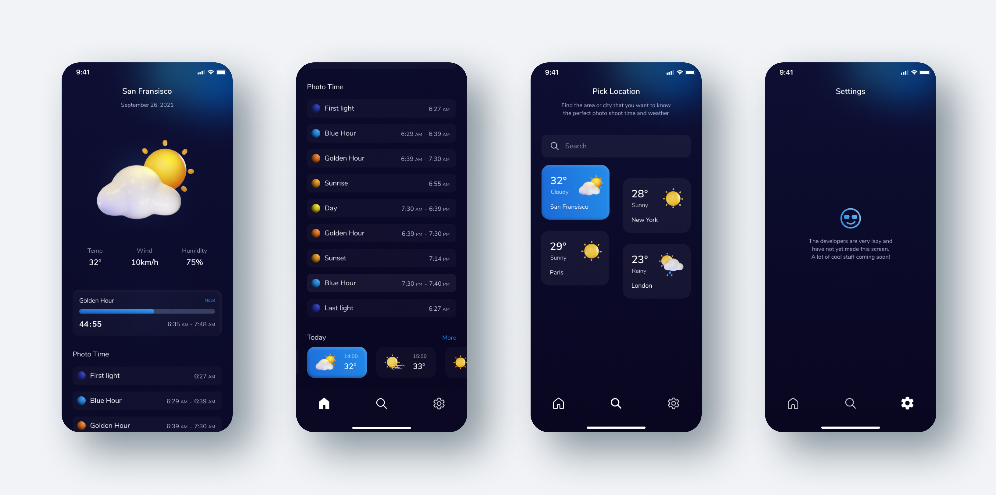

  Golden hour calculator android app built with Jetpack Compose

## 🎯 Features

#### Photome calculates the time of the golden and blue hours, and also shows the weather anywhere in the world. A trusted assistant for any photographer!

## ⚙️ Technologies
| Technology                                                       | Description                                                                                                     |
|:------------------------------------------------------------------|:-----------------------------------------------------------------------------------------------------------------|
| [Jetpack Compose](https://developer.android.com/jetpack/compose) | Modern toolkit for building native UI. It simplifies and accelerates UI development on Android                  |
| [Koin](https://insert-koin.io/)                                  | A smart Kotlin injection library                                                                                |
| [Retrofit](https://square.github.io/retrofit/)                   | A type-safe HTTP client for Android and Java                                                                    |
| [Protobuf](https://developers.google.com/protocol-buffers)       | Protocol buffers are a language-neutral, platform-neutral extensible mechanism for serializing structured data. |

## ⚡️ Quickstart
- Clone this project
- Follow [Android guide](https://developer.android.com/guide/slices/getting-started) for getting started building a project

## 👍 Contributing

Have a look through existing [Issues](https://github.com/phototime/android/issues) and [Pull Requests](https://github.com/phototime/android/pulls) that you could help with. If you'd like to request a feature or report a bug, please [create a GitHub Issue](https://github.com/phototime/android/issues) using one of the templates provided.

## ☕ Support 
If you want to say **thank you** and/or support the active development of `Epos Next`:

1. Add a [GitHub Star](https://github.com/phototime/android/stargazers) to the project.
2. Support me on [Patreon](https://www.patreon.com/zotovy)
